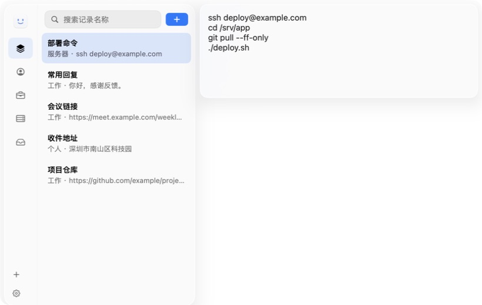

<p align="center">
  
</p>

<h1 align="center">Benri</h1>

<p align="center">
  A fast, local-only macOS panel for reusable text.<br>
  Find a note, copy it, and paste it back into your current app without breaking your flow.
</p>

<p align="center">
  <a href="README.zh-CN.md">简体中文</a>
  ·
  <a href="https://github.com/crimsonteps/benri/releases/latest">Download</a>
  ·
  <a href="https://github.com/crimsonteps/benri/issues">Report a bug</a>
</p>

<p align="center">
  <a href="https://github.com/crimsonteps/benri/actions/workflows/ci.yml"></a>
  
  
  <a href="LICENSE"></a>
</p>

<p align="center">
  
</p>

> [!NOTE]
> The current `main` branch targets the upcoming v1.1.0 release. The latest public download is still v1.0.0; backup, restore, and diagnostic export will become available with v1.1.0.

## Highlights

- Open Benri anywhere with a global keyboard shortcut
- Find reusable text quickly with title search
- Capture and search local text and image clipboard history
- Press `Tab` to switch between reusable text and clipboard history
- Browse, select, and open read-only previews entirely from the keyboard
- Press `Return` to copy the selected content and paste it back into the previous app
- Edit free-form multi-line text with automatic saving
- Keep data encrypted on your Mac, with validated backup and restore

## System experience

- Lives in the menu bar without a Dock icon
- Adapts to light mode, dark mode, reduced transparency, and macOS 26 Liquid Glass
- Falls back to copy-only behavior when Accessibility permission is unavailable

## Requirements

- macOS 13 Ventura or later
- Accessibility permission only if you want Benri to paste automatically into another app

## Install

1. Download the latest `Benri-vX.Y.Z-macOS-universal.zip` from [Releases](https://github.com/crimsonteps/benri/releases/latest).
2. Unzip it and move `Benri.app` to `/Applications`.
3. Open Benri and optionally grant Accessibility permission when macOS asks.

GitHub displays the SHA-256 digest next to the release asset, so no separate checksum download is required.

The current v1.0.0 build is ad-hoc signed and not notarized, so macOS may require you to Control-click the app and choose **Open**. Starting with v1.1.0, release automation publishes an archive only after Developer ID signing, notarization, and Gatekeeper verification all succeed.

## Keyboard workflow

| Shortcut | Action |
| --- | --- |
| Configurable global shortcut | Show or hide Benri |
| Optional clipboard shortcut | Open clipboard history directly |
| `Tab` | Switch between reusable text and clipboard history |
| `↑` / `↓` | Move through reusable text or clipboard items |
| `→` | Open the selected record's read-only preview |
| `←` | Close the preview |
| `Return` | Copy the selected record and paste into the previous app |
| `⌘Return` | Copy the selected clipboard item without pasting |
| `⌥Return` | Paste a clipboard item while keeping the panel open |
| `⌘.` | Pin or unpin a clipboard item |
| `⌘K` | Open or close the selected item's Actions panel |
| `⌃X` | Delete the selected clipboard item |
| `⌃⇧X` | Clear clipboard history after confirmation |
| `⌘F` | Focus the record search field |
| `⌘N` | Create a record |
| `⌃Return` | Open the action menu for the selected record |
| `⌘E` | Edit the selected record |
| `⌘⌫` | Delete the selected record |
| `⌘S` or `⌘Return` | Save record edits |
| `⌘,` | Open Settings |
| `Esc` | Close the editor or hide the panel |

If automatic paste is not permitted or cannot complete, the content remains on the system clipboard so you can paste it manually.

## Privacy and data

Benri stores its data in its own Application Support directory:

```text
~/Library/Application Support/Benri/vault.qv
~/Library/Application Support/Benri/vault.key
```

- The vault is encrypted with AES-256-GCM and restricted to the current macOS user.
- Benri does not upload records, keys, or usage data, and makes no background network requests.
- Benri never silently replaces a vault that it cannot decrypt or recognize.
- Backups are validated before restore, and a recovery copy is kept before replacing a healthy vault.

Clipboard history starts only after first-use confirmation and is stored as a plaintext cache at:

```text
~/Library/Caches/com.crimsonteps.benri/Clipboard/
```

It is retained for 90 days by default and can be paused, cleared, or disabled per source application. Benri skips common sensitive pasteboard markers. Clipboard history is excluded from `.benribackup` packages and is not removed by Reset Vault.

The key and encrypted vault are stored under the same macOS user account, so Benri cannot defend against software or people that already control the logged-in account. A `.benribackup` package includes the matching recovery key and must be protected like the original data. Benri is a convenience utility, not a replacement for a dedicated password manager. See [SECURITY.md](SECURITY.md) for the complete security boundary.

Use **File → Back Up Vault…**, **Restore Vault…**, or **Export Diagnostics…**. Diagnostic reports contain version, system, permission, and file metadata only; they intentionally exclude record names and content.

Please report security issues through [GitHub's private security advisory form](https://github.com/crimsonteps/benri/security/advisories/new), not a public issue.

## Build from source

Benri is a Swift Package Manager app with no external package dependencies. Xcode or the macOS Command Line Tools with Swift 6 are sufficient.

```bash
git clone https://github.com/crimsonteps/benri.git
cd benri
make test
make app
open dist/Benri.app
```

Useful commands:

```bash
make build       # Debug build
make release     # Build a Universal 2 release zip
make clean
```

## Project structure

```text
Sources/Benri/       AppKit and SwiftUI application
Sources/BenriCore/   Models, encryption, key, and file storage
Sources/BenriChecks/ Automated checks
Resources/           Info.plist, icons, and README images
Scripts/             App and release packaging
```

## Scope

Benri intentionally stays focused on a fast, single-Mac workflow for reusable text and clipboard history. Cloud sync, browser autofill, and cross-platform clients are outside the current scope.

## Contributing

Bug reports and focused pull requests are welcome. Please read [CONTRIBUTING.md](CONTRIBUTING.md) before submitting a change. Maintainers can find the release checklist in [RELEASING.md](RELEASING.md).

## License

Benri is available under the [MIT License](LICENSE).
